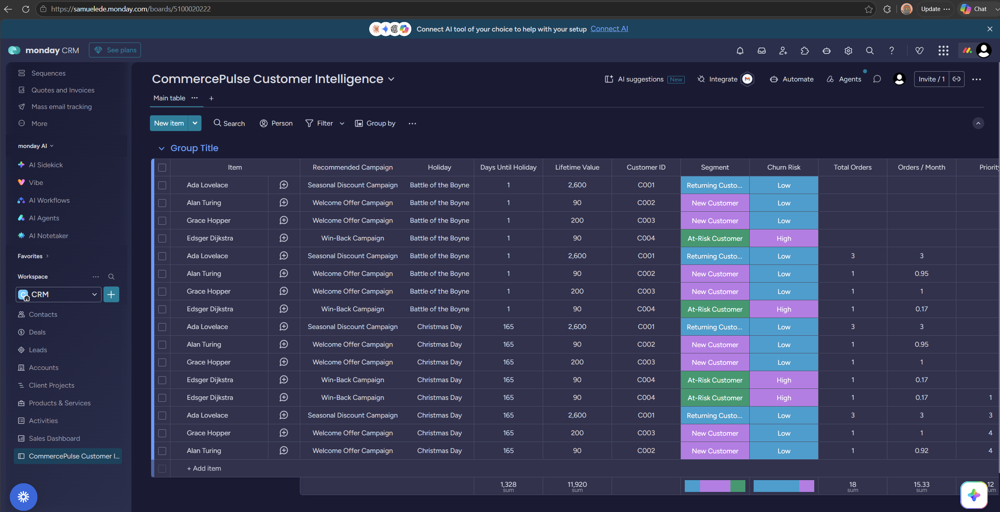

# CommercePulse Analytics

[](LICENSE)
[](https://www.python.org/downloads/release/python-3119/)
[](https://airflow.apache.org/)
[](https://www.postgresql.org/)
[](https://pandas.pydata.org/)
[](https://docs.docker.com/compose/)
[](https://developer.monday.com/api-reference/)
[](tests/)
[]()

Customer intelligence and Reverse ETL platform built on the Mandera Analytics commerce data. CommercePulse extracts customer, product, and order data from PostgreSQL staging, builds customer segmentation and a Customer 360 view, enriches recommendations with public holiday data, and pushes the results into Monday CRM so marketing, sales, and customer success teams can act on them directly.

Runs standalone: the stack includes its own seeded PostgreSQL, so no upstream pipeline is required to try it.

## Architecture


The pipeline moves customer data through six stages: extraction from Mandera's PostgreSQL staging schema, segmentation and Customer 360 analytics in Pandas, enrichment with public holiday data, validation, persistence into an analytics schema, and Reverse ETL activation into Monday CRM. Apache Airflow orchestrates the run; Docker containerizes the stack.

## Documentation
 
- **[Data Dictionary](docs/DATA_DICTIONARY.md)** — every field, its type, how it is derived, and the business rules behind every classification
- **[Live Monday CRM board](https://samuelede.monday.com/boards/5100020222)** — the activation surface, populated by the pipeline
## Output datasets (analytics schema)
 
| Table | Key columns |
|-------|-------------|
| `customer_segmentation` | customer_id, customer_name, total_orders, total_spend, segment |
| `customer_360` | customer_id, lifetime_value, total_orders, purchase_frequency, last_purchase_date, preferred_category, churn_risk |
| `campaign_recommendations` | customer_id, segment, churn_risk, lifetime_value, holiday_name, days_until_holiday, recommended_campaign, priority |
 
Segments: New Customer, Returning Customer, VIP Customer, At-Risk Customer.
 
`purchase_frequency` is a **rate**, orders per month across the customer's active lifespan (first purchase to today), not a raw count. `total_orders` carries the count. The distinction matters: two customers with four orders each are very different propositions if one bought them last month and the other over three years, and a bare count cannot tell them apart.
 
### Campaign rules
 
Segment alone is too blunt to drive engagement, so the rule engine combines **segment, churn risk, and lifetime value** with the upcoming holiday. The primary rule is a segment × churn-risk matrix; lifetime value then acts as an override for cases segment cannot see.
 
The case that motivates this: segmentation labels *any* lapsed customer At-Risk, so a customer worth £14,400 and one worth £90 land in the same bucket and would receive the same generic win-back. Customer 360 separates them.
 
| Customer | Segment | Churn | LTV | Campaign | Priority |
|---|---|---|---|---|---|
| Barbara | At-Risk | High | £14,400 | **Premium Win-Back** | 1 |
| Edsger | At-Risk | High | £90 | Win-Back | 1 |
| Ada | Returning | Low | £2,600 | Seasonal Discount | 3 |
| Grace | New | Low | £200 | Welcome Offer | 4 |
 
Every recommendation carries a **priority** (1 = act now, 4 = routine) so the CRM can be worked top-down by urgency rather than by customer id. A Returning customer spending above 60% of the VIP threshold is promoted to a VIP Upgrade Offer; recognising that early is the difference between growing the account and letting a competitor grow it.
 
Customer 360 is optional. Without it the engine degrades to segment-only rules, which is weaker but still valid.
 
## Repository layout
 
```
commercepulse/
├── dags/
│   └── commercepulse_dag.py        # Airflow DAG
├── docs/
│   ├── DATA_DICTIONARY.md            # Fields, types, derivations, business rules
│   ├── monday-crm-board.png          # CRM board screenshot
│   ├── pipeline-architecture.drawio  # Editable diagram source
│   └── pipeline-architecture.svg     # Exported diagram (rendered in README)
├── python/
│   ├── pipeline.py                 # Standalone end-to-end entrypoint
│   ├── extract/extract_staging.py  # Pull staging tables
│   ├── transform/
│   │   ├── segmentation.py
│   │   ├── customer_360.py
│   │   └── validation.py
│   ├── enrich/
│   │   ├── holiday_api.py          # Holiday API connector
│   │   └── campaigns.py            # Recommendation engine
│   ├── load/
│   │   ├── load_analytics.py       # Write to analytics schema
│   │   └── monday_crm.py           # Reverse ETL to Monday CRM
│   └── utils/
│       ├── config.py
│       └── db.py
├── sql/
│   ├── 01_create_analytics_schema.sql
│   └── 02_seed_sample_data.sql     # Optional local test data
├── scripts/
│   ├── healthcheck.sh              # Validate every layer of the stack
│   └── check_monday.py             # Verify Monday token and board
├── tests/test_pipeline.py
├── requirements.txt
├── requirements-airflow.txt
├── Dockerfile
├── docker-compose.yml
├── .env.example
└── README.md
```
 
## Relationship to the Mandera pipeline
 
Mandera is the upstream source system: its batch pipeline (MongoDB Atlas → MinIO → PostgreSQL) lands cleaned customer, product, and order data into a PostgreSQL staging schema. CommercePulse reads from that schema and turns it into customer intelligence.
 
**Mandera does not need to be running to use this project.** CommercePulse ships with its own PostgreSQL service and seed data, so it stands alone with a single `docker compose up`. Two ways to run it:
 
| Mode | Source of staging data | When to use |
|------|------------------------|-------------|
| **Self-contained** (default) | Bundled `data-db` service, auto-seeded from `sql/02_seed_sample_data.sql` | Demos, evaluation, local development |
| **Connected** | A live Mandera staging PostgreSQL | Running the two projects as one system |
 
To switch to connected mode, point the `PG_*` variables in `.env` at the Mandera instance, delete `sql/02_seed_sample_data.sql` so it does not overwrite real data, and remove the `data-db` service (and its `depends_on` entry) from `docker-compose.yml`.
 
## Prerequisites
 
- Docker and Docker Compose
- Python 3.11 specifically (only if running the pipeline outside Docker). Not 3.12+, Airflow 2.9.3 does not support it and several pinned dependencies have no wheels for newer versions. This matches the `apache/airflow:2.9.3-python3.11` base image.
- A Monday.com account with an API token and a target board
- Optional: a Calendarific API key (the pipeline falls back to the keyless Nager.Date API if none is supplied)
## Setup
 
### 1. Clone and configure
 
```bash
git clone https://github.com/samuelede/CommercePulse-Analytics.git
cd CommercePulse-Analytics
cp .env.example .env
```
 
Edit `.env` and set `MONDAY_API_TOKEN` and `MONDAY_BOARD_ID`. Leave the `PG_*` defaults alone unless you are running in connected mode against a real Mandera instance.
 
### 2. Configure the Monday CRM board
 
Create a board in Monday (**+ Add → New Board**) and take the board ID from its URL:
 
```
https://your-account.monday.com/boards/1234567890
                                       ^^^^^^^^^^ board ID
```
 
Put the token and board ID in `.env`:
 
```
MONDAY_API_TOKEN=your_personal_token
MONDAY_BOARD_ID=1234567890
```
 
Get the token from monday.com: **avatar (bottom-left) → Administration → Developers → My Access Tokens → Show**.
 
That is all the board setup required. The pipeline is self-configuring: on every run `ensure_columns()` reads the board and creates any column that is missing, so column IDs never need to be looked up or hardcoded. The columns it manages are:
 
| Column | Type | Source |
|--------|------|--------|
| (item name) | — | customer_name |
| Customer ID | Text | segmentation |
| Priority | Numbers | campaign rules (1 = act now) |
| Segment | Status | segmentation |
| Recommended Campaign | Text | campaigns |
| Holiday | Text | Holiday API |
| Days Until Holiday | Numbers | Holiday API |
| Churn Risk | Status | Customer 360 |
| Lifetime Value | Numbers | Customer 360 |
| Total Orders | Numbers | Customer 360 |
| Orders / Month | Numbers | Customer 360 |
 
Segment and Churn Risk are **status** columns so the board can be filtered and grouped by them. Labels are created automatically on first sync.
 
## Run with Docker (recommended)
 
```bash
# Build the custom Airflow image
docker compose build
 
# Initialize Airflow metadata DB and admin user
docker compose up airflow-init
 
# Start the stack
docker compose up -d
```
 
On first start the `data-db` service auto-loads everything in `sql/`, creating the analytics schema and seeding staging with sample customers, products, and orders. The pipeline has data to work with immediately.
 
Open the Airflow UI at http://localhost:8080 and log in with `airflow` / `airflow`.
 
The DAG appears **paused**. This is deliberate (`DAGS_ARE_PAUSED_AT_CREATION` is on), so a newly deployed DAG does not immediately start firing scheduled runs. To run it:
 
1. Click the **toggle switch** to the left of `commercepulse_pipeline` to unpause it.
2. Click the **play button** (top right) to trigger a manual run, rather than waiting for the `@daily` schedule.
Set `MONDAY_API_TOKEN` and `MONDAY_BOARD_ID` in `.env` before the first run. Without them the `reverse_etl_monday` task logs an error and pushes zero items, while the upstream tasks still succeed, so the run looks healthy but nothing reaches the CRM.
 
Task flow: `extract_staging` fans out to `build_segmentation` and `build_customer_360`; segmentation feeds `build_campaigns`; campaigns and customer_360 both feed `reverse_etl_monday`.
 
Stop the stack:
 
```bash
docker compose down          # keep data
docker compose down -v        # remove volumes
```
 
## Run standalone (without Airflow)
 
Create the virtual environment against Python 3.11 explicitly. If a newer
interpreter is your system default, `python -m venv` will pick it up and the
install will fail.
 
```bash
# Windows (Git Bash)
py -3.11 -m venv .venv
source .venv/Scripts/activate
 
# macOS / Linux
python3.11 -m venv .venv
source .venv/bin/activate
```
 
Confirm the interpreter before installing:
 
```bash
python --version                 # must report 3.11.x
pip install -r requirements.txt
cp .env.example .env             # set PG_* to a reachable Postgres
```
 
Create the analytics schema (only needed if not using Docker seed):
 
```bash
psql "$DATABASE_URL" -f sql/01_create_analytics_schema.sql
```
 
Run the full pipeline:
 
```bash
PYTHONPATH=. python -m python.pipeline
```
 
`PYTHONPATH=.` puts the project root on the import path so absolute imports like `from python.utils.config import config` resolve. Run from the project root. The Docker containers do not need this; compose sets `PYTHONPATH=/opt/airflow` for them.
 
Run analytics only, skipping the CRM push. Useful for confirming segmentation and Customer 360 land in Postgres before wiring up Monday:
 
```bash
PYTHONPATH=. python -m python.pipeline --skip-crm
```
 
Run individual stages for debugging:
 
```bash
PYTHONPATH=. python -m python.extract.extract_staging
PYTHONPATH=. python -m python.enrich.holiday_api
```
 
## Tests
 
```bash
PYTHONPATH=. pytest tests/ -q
```
 
## Verifying the stack
 
Run the health check. It validates each layer independently, so a failure tells you exactly where the problem is:
 
```bash
bash scripts/healthcheck.sh
```
 
It checks container status, the SQLAlchemy version inside the image, webserver reachability, staging data, analytics outputs, and Monday credentials.
 
To check just the Monday connection:
 
```bash
PYTHONPATH=. python scripts/check_monday.py
```
 
### Manual checks
 
```bash
# Containers up?
docker compose ps
 
# Webserver serving?
curl -I http://127.0.0.1:8080/health
 
# Correct SQLAlchemy in the image?
docker compose exec airflow-scheduler python -c "import sqlalchemy; print(sqlalchemy.__version__)"
 
# Staging seeded?
docker compose exec data-db psql -U postgres -d mandera -c "\dt staging.*"
 
# Analytics populated?
docker compose exec data-db psql -U postgres -d mandera \
  -c "SELECT segment, count(*) FROM analytics.customer_segmentation GROUP BY 1;"
```
 
## Customer intelligence in Monday CRM
 

 
**Live board:** [CommercePulse Customer Intelligence](https://samuelede.monday.com/boards/5100020222)
 
This is the point of the whole pipeline. Analytics that stay in a warehouse cannot be acted on; a sales rep does not open psql. The board puts customer intelligence where the people who act on it already work.
 
A rep sorts by **Priority** and works down. The two rows at the top show why Customer 360 feeds the rule engine rather than merely decorating the board:
 
| Customer | Segment | Churn | Lifetime value | Campaign | Priority |
|---|---|---|---|---|---|
| Barbara Liskov | At-Risk | High | £14,400 | **Premium Win-Back** | 1 |
| Edsger Dijkstra | At-Risk | High | £90 | Win-Back | 1 |
 
Identical segment, identical churn risk. A segment-only engine cannot tell them apart and hands both the same generic win-back. Lifetime value separates them: Barbara is a £14,400 customer who has gone quiet, and the most expensive person on the board to lose.
 
Segment and Churn Risk are status columns, so the board can be filtered and grouped by them without any further setup.
 
## Populating Monday CRM
 
Airflow is only the scheduler. The pipeline runs without it, which is the quickest way to prove the data path end to end.
 
```bash
# 1. Analytics only. Confirms extract, transform, and load work.
python -m python.pipeline --skip-crm
 
# 2. Confirm the outputs landed.
docker compose exec data-db psql -U postgres -d mandera \
  -c "SELECT * FROM analytics.campaign_recommendations;"
 
# 3. Confirm Monday is reachable and see which columns will be created.
PYTHONPATH=. python scripts/check_monday.py
 
# 4. Full run. Creates any missing board columns, then syncs.
python -m python.pipeline
```
 
Step 4 logs `Synced N of N items to Monday CRM`. The board will then show one item per customer, titled with the customer name, with Segment and Churn Risk as colour-coded status columns.
 
## Configuration reference
 
All settings come from environment variables (see `.env.example`). Key tunables:
 
- `VIP_SPEND_THRESHOLD`, `VIP_ORDER_THRESHOLD` — VIP cutoffs
- `RETURNING_ORDER_THRESHOLD` — minimum orders for Returning segment
- `CHURN_DAYS_THRESHOLD` — days of inactivity before At-Risk / High churn
- `HOLIDAY_COUNTRY`, `HOLIDAY_YEAR` — holiday lookup scope
- `HOLIDAY_MIN_LEAD_DAYS` (default 14) — minimum days before a holiday for it to be selected
- `HOLIDAY_NATIONWIDE_ONLY` (default true) — exclude subdivision-specific holidays
### Holiday selection
 
Campaign recommendations anchor to a single upcoming holiday, and picking the *nearest* one is not the same as picking a *useful* one. Two filters make the choice defensible:
 
**Lead time.** A holiday two days away cannot be planned around. There is no time to brief, build, and ship a campaign, so a recommendation pegged to it is accurate and worthless. The pipeline selects the nearest holiday at least `HOLIDAY_MIN_LEAD_DAYS` out.
 
**Nationwide only.** A UK holiday query returns regional dates such as the Battle of the Boyne (Northern Ireland) and St Andrew's Day (Scotland). Anchoring a nationwide campaign to a holiday most customers do not observe is a business error. Regional holidays are excluded by default.
 
Both are configurable. Setting `HOLIDAY_MIN_LEAD_DAYS=0` and `HOLIDAY_NATIONWIDE_ONLY=false` restores naive nearest-holiday behaviour.
 
The lookup spans `HOLIDAY_YEAR` and the following year, so a run in December still finds an actionable holiday rather than falling off the end of the calendar.
 
## Troubleshooting
 
**`AttributeError: 'Engine' object has no attribute 'cursor'` in an Airflow task**
 
SQLAlchemy 1.4 is installed in the image. pandas 2.2.x checks for the SQLAlchemy `Connectable` type, which was removed in 2.0, so under 1.4 the check fails, pandas falls back to its raw DBAPI path, and every `read_sql`/`to_sql` breaks with this misleading error.
 
Airflow's constraint file pins SQLAlchemy 1.4, so the image must override it. `requirements-airflow.txt` pins `SQLAlchemy>=2.0.30`, and the Dockerfile asserts the version at build time. If you hit this, the image is stale:
 
```bash
docker compose down
docker compose build --no-cache
docker compose up -d
```
 
Confirm the version inside the container:
 
```bash
docker compose exec airflow-scheduler python -c "import sqlalchemy; print(sqlalchemy.__version__)"
```
 
Anything below 2.0 means the rebuild did not take.
 
**`could not translate host name "postgres" to address` / `connection refused`**
 
`PG_HOST` is set to a Docker service name, which only resolves from inside the Docker network. Running from your venv on the host, use the published port instead:
 
```
PG_HOST=127.0.0.1
PG_PORT=5434
```
 
The rule: **`data-db:5432` inside a container, `127.0.0.1:5434` on the host.** `docker-compose.yml` already injects the container values into Airflow, so `.env` only ever needs the host-side ones. Prefer `127.0.0.1` over `localhost` on Windows, where `localhost` can resolve to IPv6 and fail to connect.
 
Check the database is actually up:
 
```bash
docker compose ps data-db
docker compose exec data-db psql -U postgres -d mandera -c "\dt staging.*"
```
 
**DAG appears in the UI but never runs**
 
It is paused. New DAGs default to paused so they do not immediately backfill. Click the toggle to the left of the DAG name to unpause, then use the play button to trigger a manual run.
 
**`Failed to build 'pyarrow'` or `ModuleNotFoundError: No module named 'pkg_resources'` during install**
 
The venv was built against a Python newer than 3.11. Check with `python --version`, then rebuild:
 
```bash
deactivate
rm -rf .venv
py -3.11 -m venv .venv          # Windows; use python3.11 on macOS/Linux
source .venv/Scripts/activate
pip install -r requirements.txt
```
 
**`numpy.dtype size changed, may indicate binary incompatibility`**
 
numpy 2.x was installed alongside pandas 2.2.2. Reinstall from the pinned requirements:
 
```bash
pip install -r requirements.txt --force-reinstall
```
 
**`ModuleNotFoundError: No module named 'python'` when running the pipeline**
 
`PYTHONPATH` is not set. Run from the project root with `PYTHONPATH=.` prefixed, as shown above.
 
**Monday sync reports 0 items pushed**
 
`MONDAY_API_TOKEN` or `MONDAY_BOARD_ID` is unset in `.env`, or the token lacks access to that board. Verify the token first:
 
```bash
PYTHONPATH=. python -c "
from python.load.monday_crm import monday_request
print(monday_request('query { me { name email } }'))
"
```
 
A name and email confirms the token works. Column IDs are resolved automatically at runtime, so they are never the cause.
 
## Notes
 
- PostgreSQL is mapped to host port 5434 to avoid clashing with the Mandera stack (5433).
- pandas is pinned to 2.2.2 and numpy to 1.26.4. numpy is deliberately held below 2.x: pandas 2.2.2 predates the numpy 2.0 ABI break, and pairing it with numpy 2.x can raise `numpy.dtype size changed` at import.
- SQLAlchemy must be **2.x** in both the venv and the Airflow image. pandas 2.2.x requires it: pandas checks for the `Connectable` type that SQLAlchemy removed in 2.0, and under 1.4 it silently degrades to a raw DBAPI path that fails on every query. Airflow 2.9.3's constraint file pins 1.4, so `requirements-airflow.txt` deliberately overrides it and the Dockerfile asserts the result at build time.
- There is no pyarrow dependency. The pipeline reads and writes exclusively through SQLAlchemy/psycopg2 and never touches Parquet or Arrow.
- The Holiday connector uses Calendarific when a key is set and falls back to the keyless Nager.Date API otherwise.
## Contributing
 
Issues and pull requests are welcome.
 
**Development setup**
 
```bash
git clone https://github.com/samuelede/CommercePulse-Analytics.git
cd CommercePulse-Analytics
py -3.11 -m venv .venv          # Windows; python3.11 on macOS/Linux
source .venv/Scripts/activate
pip install -r requirements.txt
cp .env.example .env
```
 
**Before opening a pull request**
 
1. Branch from `main` using a descriptive name (`feature/`, `fix/`, `docs/`).
2. Keep the test suite green:
```bash
   PYTHONPATH=. pytest tests/ -q
```
3. Add tests for new behaviour. Business rules in particular (segmentation thresholds, churn logic, campaign mapping) should be covered by a test that would fail if the rule were quietly changed.
4. Run the health check if your change touches the stack:
```bash
   bash scripts/healthcheck.sh
```
5. Update the README if you change configuration, schemas, or the board layout.
**Commit messages**
 
Explain both what changed and why, and reference the concrete error or behaviour that prompted the fix. Prefer several purposeful commits over one large one.
 
```
Split total_orders from purchase_frequency in Customer 360
 
purchase_frequency was a raw order count, which cannot distinguish four
orders last month from four orders over three years. total_orders now
carries the count; purchase_frequency is orders per month across the
customer's active lifespan.
```
 
**Things to be careful with**
 
- Never commit `.env`. It is gitignored; keep it that way.
- Changing a column's type in `COLUMN_PLAN` requires deleting and recreating that column on the Monday board, since Monday cannot alter a column type after creation. `ensure_columns()` will raise with instructions rather than fail silently.
- Dependency pins in `requirements.txt` and `requirements-airflow.txt` are load-bearing. See the Notes section before relaxing any of them.
## License
 
Released under the [MIT License](LICENSE).